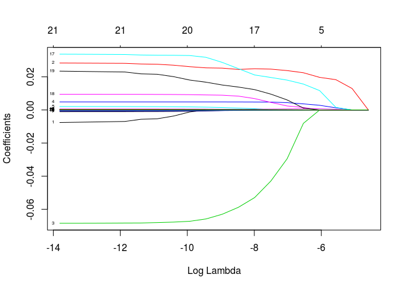
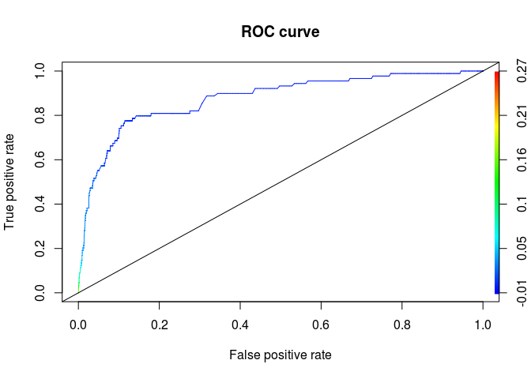
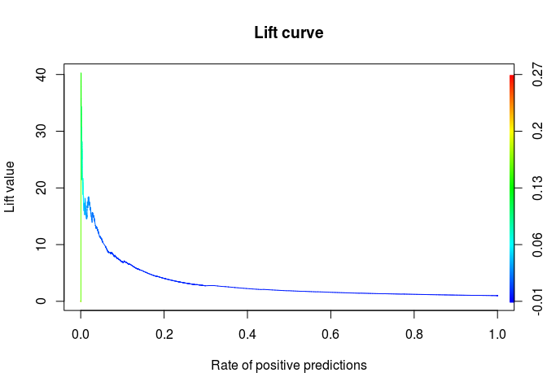

# Logistic Regression

In this tutorial I will demonstrate Logistic Regression. This project has been done for Data Science course with Prof. Harner.

This data is from M6D, predicted attribute is y\_buy and attribute information are at\_buy\_boolean ; at\_freq\_buy ; at\_freq\_last24\_buy; at\_freq\_last24\_sv; at\_freq\_last24\_sv\_int\_buy; at\_freq\_sv; at\_freq\_sv\_int\_buy; at\_interval\_buy; at\_interval\_sv; at\_interval\_sv\_int\_buy; expected\_time\_buy; expected\_time\_sv; expected\_time\_sv\_int\_buy; last\_buy; last\_sv; last\_sv\_int\_buy; multiple\_buy; multiple\_sv; multiple\_sv\_int\_buy; uniq\_content\_links; num\_checkins

#### 1 Randomly split the data such that approximately 65% of the observations are in the `train` data set and the remaining observations are in the `test` data set.

``` r
set <- read.table("dds_ch5_binary_class_dataset.txt", header = TRUE, sep = "\t")
dim(set)
```
  ## [1] 54584    22


``` r
rate = .65;
tr.sample<- sample(1:nrow(set),.65*nrow(set),replace=F);
train <- set[tr.sample,]
length(train[,1])/ length(set[,1])
```

    ## [1] 0.649989

``` r
te.sample <- setdiff(1:nrow(set), tr.sample)
test <- set[te.sample,]
length(test[,1]) / length(set[,1])
```

    ## [1] 0.350011

#### 2 Compute the mean and standard deviation for each of the predictors conditioned by the response `y_buy` for the training data and put the results in a 21 × 4 table. The columns headings should be means and standard deviation for each of whether the user buys (1) or not (0). Also, compute the sample sizes for buy (1) or not (0). Discuss the important differences. Compute the overall mean and standard deviation for `y_buy`.

``` r
train.1 <- train[which(train$y_buy==1),]
train.0 <- train[which(train$y_buy==0),]

train.1$y_buy <- NULL
train.0$y_buy <- NULL


mean1 <- lapply(train.1,mean)
mean0 <- lapply(train.0,mean)

sd1 <- lapply(train.1,sd)
sd0 <- lapply(train.0,sd)

#length(mean1);length(mean0);length(sd1);length(sd0)


mean1m <- as.matrix(mean1, 21,1)
mean0m <- as.matrix(mean0, 21,1)
sd1m <- as.matrix(sd1, 21,1)
sd0m <- as.matrix(sd0, 21,1)


table <- cbind(mean1m,sd1m,mean0m,sd0m)
colnames(table) <- c("meanForBuy1","SdForBuy1", "meanForBuy0","SdForBuy0"); table
```

    ##                           meanForBuy1 SdForBuy1  meanForBuy0 SdForBuy0 
    ## at_buy_boolean            0.3841463   0.4878825  0.04171032  0.1999292 
    ## at_freq_buy               0.7073171   1.542747   0.05031856  0.2778154 
    ## at_freq_last24_buy        0.006097561 0.07808688 0.001868894 0.0463533 
    ## at_freq_last24_sv         1.085366    2.381942   0.1090755   0.7720965 
    ## at_freq_last24_sv_int_buy 0.4634146   1.556267   0.02132238  0.41904   
    ## at_freq_sv                7.036585    9.850347   1.843438    2.976201  
    ## at_freq_sv_int_buy        4.664634    10.10696   0.265921    2.231858  
    ## at_interval_buy           5.030477    19.67675   0.1956842   3.697438  
    ## at_interval_sv            9.148645    17.08903   5.84872     17.63177  
    ## at_interval_sv_int_buy    3.131056    7.06664    0.3873704   4.073289  
    ## expected_time_buy         -2.848598   17.59839   -0.172242   4.620932  
    ## expected_time_sv          -5.402908   26.82898   -10.18987   31.77645  
    ## expected_time_sv_int_buy  -1.173724   10.56668   -0.9213564  9.709793  
    ## last_buy                  17.42073    36.90611   2.713578    17.20275  
    ## last_sv                   19.86585    35.76809   64.86368    53.3464   
    ## last_sv_int_buy           5.060976    15.50844   1.76384     13.02833  
    ## multiple_buy              0.1463415   0.3545308  0.005606683 0.07466864
    ## multiple_sv               0.7560976   0.4307498  0.2757468   0.4468962 
    ## multiple_sv_int_buy       0.347561    0.4776542  0.03191278  0.1757704 
    ## uniq_content_links        69.5122     63.59134   86.78043    62.08317  
    ## num_checkins              635.75      1066.321   722.6796    1273.928


By looking at the table we can see that most of the mean values  for the cases that lead to buy are greater than the cases that are not leaded to buy

``` r
samplesizey1 <- length(which(set$y_buy==1)) ; samplesizey1
```

    ## [1] 253

``` r
samplesizey0 <- length(which(set$y_buy==0)) ; samplesizey0
```

    ## [1] 54331

``` r
mean(set$y_buy)
```

    ## [1] 0.004635058

``` r
sd(set$y_buy)
```

    ## [1] 0.06792392

#### 3 Fit and summarize the logistic regression model on the training data using all the predictors. Discuss.

``` r
train.log <- glm(train$y_buy ~ . ,data=train,  family = binomial(logit))
```

``` r
summary(train.log)
```

    ## 
    ## Call:
    ## glm(formula = train$y_buy ~ ., family = binomial(logit), data = train)
    ## 
    ## Deviance Residuals: 
    ##     Min       1Q   Median       3Q      Max  
    ## -1.4836  -0.0782  -0.0558  -0.0344   4.1628  
    ## 
    ## Coefficients:
    ##                             Estimate Std. Error z value Pr(>|z|)    
    ## (Intercept)               -5.663e+00  2.427e-01 -23.331  < 2e-16 ***
    ## at_buy_boolean             1.751e+00  6.250e-01   2.801 0.005093 ** 
    ## at_freq_buy                2.352e-01  1.423e-01   1.653 0.098290 .  
    ## at_freq_last24_buy        -1.918e+00  1.078e+00  -1.780 0.075096 .  
    ## at_freq_last24_sv          1.373e-01  3.690e-02   3.720 0.000199 ***
    ## at_freq_last24_sv_int_buy -6.402e-02  6.058e-02  -1.057 0.290568    
    ## at_freq_sv                 2.512e-02  1.610e-02   1.560 0.118667    
    ## at_freq_sv_int_buy        -4.310e-02  2.260e-02  -1.907 0.056502 .  
    ## at_interval_buy            3.581e-03  8.111e-03   0.442 0.658848    
    ## at_interval_sv            -1.353e-02  7.220e-03  -1.874 0.060990 .  
    ## at_interval_sv_int_buy    -1.637e-02  1.721e-02  -0.951 0.341687    
    ## expected_time_buy         -4.451e-04  6.424e-03  -0.069 0.944761    
    ## expected_time_sv           3.826e-03  6.601e-03   0.580 0.562155    
    ## expected_time_sv_int_buy   2.001e-02  1.342e-02   1.492 0.135786    
    ## last_buy                   4.890e-03  3.794e-03   1.289 0.197380    
    ## last_sv                   -1.645e-02  4.790e-03  -3.434 0.000594 ***
    ## last_sv_int_buy            6.329e-03  9.796e-03   0.646 0.518212    
    ## multiple_buy               7.713e-01  5.631e-01   1.370 0.170826    
    ## multiple_sv                1.679e+00  3.087e-01   5.441 5.31e-08 ***
    ## multiple_sv_int_buy       -4.555e-01  6.830e-01  -0.667 0.504826    
    ## uniq_content_links        -2.634e-03  1.552e-03  -1.697 0.089657 .  
    ## num_checkins               3.470e-05  7.179e-05   0.483 0.628825    
    ## ---
    ## Signif. codes:  0 '***' 0.001 '**' 0.01 '*' 0.05 '.' 0.1 ' ' 1
    ## 
    ## (Dispersion parameter for binomial family taken to be 1)
    ## 
    ##     Null deviance: 2090.8  on 35478  degrees of freedom
    ## Residual deviance: 1677.6  on 35457  degrees of freedom
    ## AIC: 1721.6
    ## 
    ## Number of Fisher Scoring iterations: 10

From the summary it is inferred that some of the variables like at_buy_boolean, at_freq_last24_sv, last_sv, multiple_sv are the most effective parameters on buying the product. 


#### 4 Compute the confusion matrix on the test data for the complete model.

``` r
train.pclass <- ifelse(predict(train.log, type = "response") < 0.5, 0, 1)
table(train.pclass,train$y_buy)
```

    ##             
    ## train.pclass     0     1
    ##            0 35314   163
    ##            1     1     1

#### 5 Perform variable selection on on the training data set and determine the best reduced model. Summarize the model and discuss.


``` r
train.model <- model.matrix(y_buy ~ ., train)[, -1]
train.lasso <- glmnet(train.model, train$y_buy, alpha=1, nlambda=20)
print(train.lasso)
```

    ## 
    ## Call:  glmnet(x = train.model, y = train$y_buy, alpha = 1, nlambda = 20) 
    ## 
    ##       Df    %Dev    Lambda
    ##  [1,]  0 0.00000 1.009e-02
    ##  [2,]  1 0.01374 6.214e-03
    ##  [3,]  4 0.02225 3.827e-03
    ##  [4,]  5 0.02677 2.357e-03
    ##  [5,] 10 0.03054 1.452e-03
    ##  [6,] 10 0.03301 8.939e-04
    ##  [7,] 15 0.03451 5.505e-04
    ##  [8,] 15 0.03537 3.390e-04
    ##  [9,] 17 0.03585 2.088e-04
    ## [10,] 18 0.03625 1.286e-04
    ## [11,] 19 0.03642 7.919e-05
    ## [12,] 20 0.03650 4.877e-05
    ## [13,] 20 0.03655 3.003e-05
    ## [14,] 21 0.03657 1.850e-05
    ## [15,] 21 0.03657 1.139e-05
    ## [16,] 21 0.03658 7.015e-06
    ## [17,] 21 0.03658 4.320e-06
    ## [18,] 21 0.03658 2.661e-06
    ## [19,] 21 0.03658 1.639e-06
    ## [20,] 21 0.03658 1.009e-06

``` r
plot(train.lasso, xvar="lambda", label=TRUE)
```



``` r
train.cv <- cv.glmnet(train.model, train$y_buy, type.measure="mae", nfolds=10, alpha=1) 
coef(train.cv, s="lambda.min")
```

    ## 22 x 1 sparse Matrix of class "dgCMatrix"
    ##                                       1
    ## (Intercept)                2.186434e-03
    ## at_buy_boolean             .           
    ## at_freq_buy                2.344488e-02
    ## at_freq_last24_buy        -2.217272e-02
    ## at_freq_last24_sv          4.162668e-03
    ## at_freq_last24_sv_int_buy  .           
    ## at_freq_sv                 6.161377e-04
    ## at_freq_sv_int_buy         .           
    ## at_interval_buy            .           
    ## at_interval_sv             .           
    ## at_interval_sv_int_buy     .           
    ## expected_time_buy          .           
    ## expected_time_sv           .           
    ## expected_time_sv_int_buy   1.302022e-04
    ## last_buy                   .           
    ## last_sv                   -1.531891e-05
    ## last_sv_int_buy           -6.872405e-05
    ## multiple_buy               1.714491e-02
    ## multiple_sv                2.116963e-03
    ## multiple_sv_int_buy        4.214767e-03
    ## uniq_content_links         .           
    ## num_checkins               .

``` r
train.cv$lambda.min
```

    ## [1] 0.001081999

``` r
train.cv.pr  <- predict(train.cv, newx = train.model, s = "lambda.min")
mse0 <- mean((train$y_buy - train.cv.pr)^2)
mse0
```

    ## [1] 0.004452471

Actually the error for test data is more important but here I just wanted to show that by using lasso which is forcing some of the coefficientsthe to be zero we can still get good answer.


#### 6 Compute the confusion matrix on the test data for the reduced model.

``` r
train.y_buy <- ifelse(train.cv.pr < 0.5, 0, 1)
table(train.y_buy , train$y_buy ) # the output of the prediction is only zero
```

    ##            
    ## train.y_buy     0     1
    ##           0 35315   164

#### 7 Plot the ROC curve and compute the AUC on the reduced model for the test data.

``` r
test.model <- model.matrix(y_buy ~ ., test)[, -1]
test.cv.pr  <- predict(train.cv, newx = test.model, s = "lambda.min")
test.rocrpred <- prediction(test.cv.pr, test$y_buy)
perf <- performance(test.rocrpred, "tpr", "fpr")
plot(perf, main="ROC curve",colorize=T)
abline(0, 1)
```



``` r
auc.test <- performance(test.rocrpred,"auc")
auc.test <- unlist(slot(auc.test, "y.values"))
auc.test
```

    ## [1] 0.8764721

#### 8 Plot the cumulative lift curve on the reduced model for the test data.

``` r
#train
# perf <- performance(train.rocrpred,"lift","rpp")
# plot(perf, main="Lift curve", colorize=T)

#test
perf <- performance(test.rocrpred,"lift","rpp")
plot(perf, main="Lift curve", colorize=T)
```


